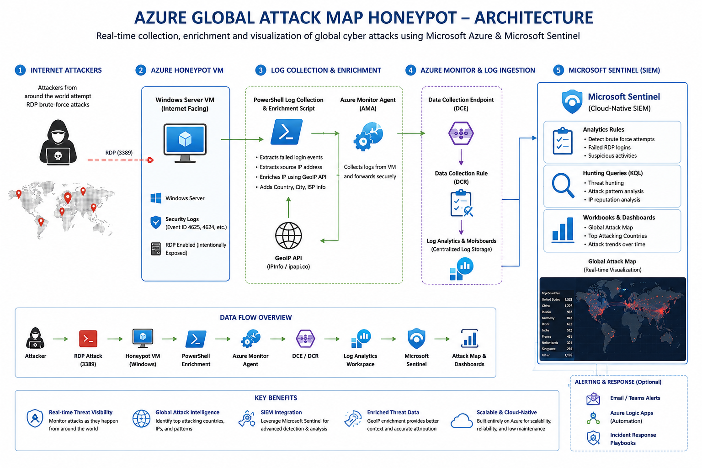

# Azure Global Attack Map Honeypot

A cloud-native cybersecurity honeypot project built on Microsoft Azure and Microsoft Sentinel to visualize real-world cyberattacks targeting an exposed Windows VM.

---

# Project Overview

This project simulates a vulnerable internet-facing Windows environment to collect and analyze malicious login attempts from attackers worldwide.

Logs are collected using Azure Monitor Agent, enriched using PowerShell scripts and GeoIP APIs, then visualized in Microsoft Sentinel through an interactive global attack map.

---

# Technologies Used

- Microsoft Azure
- Microsoft Sentinel
- Azure Monitor Agent (AMA)
- Log Analytics Workspace
- PowerShell
- Kusto Query Language (KQL)
- Windows Event Viewer
- GeoIP APIs

---

# Architecture



---

# Data Flow


---

# Features

- Real-time attack monitoring
- Failed RDP login tracking
- Geographic attack visualization
- GeoIP enrichment
- SIEM integration
- Threat hunting using KQL

---

# Attack Workflow

1. Attackers attempt RDP brute-force attacks
2. Windows Security Logs capture failed logins
3. PowerShell extracts attacker IPs
4. Azure Monitor Agent forwards logs
5. Logs enter Log Analytics Workspace
6. Microsoft Sentinel analyzes attack data
7. Workbooks visualize attacks globally

---

# Sample KQL Query

```kql
SecurityEvent
| where EventID == 4625
| summarize Attempts=count() by IPAddress
| order by Attempts desc
```

---

# Screenshots

## Global Attack Map


## Dashboard


---

# Skills Demonstrated

- SIEM Engineering
- Threat Detection
- Threat Hunting
- Cloud Security
- Azure Security
- Log Analysis
- KQL Querying
- Security Monitoring

---

# Future Improvements

- Linux honeypot integration
- Terraform deployment
- Threat intelligence feeds
- SOAR automation
- MITRE ATT&CK mapping

---
# Credits

This project was inspired by and partially based on educational cybersecurity content from Josh Madakor.

Some PowerShell log collection concepts and scripts were adapted from publicly available educational resources.

Original Creator:
Josh Madakor

# Author

Nebu Mohan
